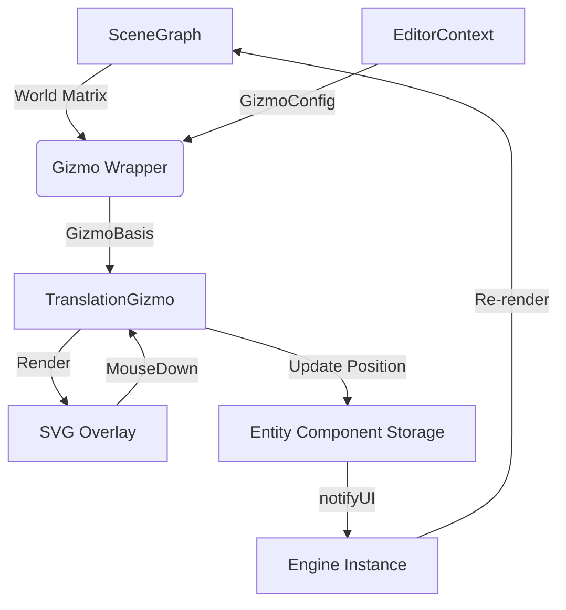

# Translation Gizmo Architecture

## Overview
The `TranslationGizmo` handles the visual representation and interaction logic for moving entities in 3D space. It uses a hybrid rendering approach: calculating 3D geometry (axes, arrowheads) and projecting it into a 2D SVG overlay for high performance and crisp UI rendering.

## Architecture & Module Interaction

### 1. Component Hierarchy
* **`SceneView`** (Container)
    * Calculates the `vpMatrix` (View-Projection Matrix) and `viewport` dimensions.
    * Renders the `Gizmo` wrapper component.
* **`Gizmo`** (Switcher)
    * Determines which tool is active (`MOVE`, `ROTATE`, `SCALE`).
    * Calculates the **`GizmoBasis`** (Origin, X/Y/Z Axes, Scale) from the Entity's World Matrix.
    * Instantiates `TranslationGizmo` when the tool is `'MOVE'`.
* **`TranslationGizmo`** (Implementation)
    * Renders the interactive SVG elements (Arrows, Planes, Center Handle).
    * Handles mouse events and updates ECS data.

### 2. Data Flow Diagram



## Interaction Logic

The Translation Gizmo employs two distinct strategies for movement to ensure the most intuitive user experience depending on the active handle.

### 1. Axis Dragging (1D Movement)
**Strategy: Screen-Space Projection**

When dragging a single axis (X, Y, or Z), the user expects the object to slide along that specific line.
1.  **Projection:** We calculate the 2D screen vector of the 3D axis.
2.  **Dot Product:** We project the mouse delta (dx, dy) onto this normalized 2D screen vector.
3.  **Result:** This ensures that moving the mouse *visually parallel* to the axis line on screen moves the object, regardless of the actual 3D orientation.

```typescript
const proj = dx * screenAxis.x + dy * screenAxis.y;
const moveAmount = proj * distanceFactor;
```

### 2. Plane Dragging (2D Movement)
**Strategy: Ray-Plane Intersection**

When dragging a plane handle (XY, XZ, YZ), the user expects the object to follow the mouse cursor as if sliding on a surface. Screen-space projection is insufficient here because it handles perspective distortion poorly for 2D surfaces.

1.  **Raycasting:** We cast a ray from the camera through the mouse cursor using the Inverse View-Projection Matrix (`invViewProj`).
2.  **Intersection:** We calculate where this ray intersects the mathematical plane defined by the gizmo's origin and the plane's normal (e.g., Normal=(0,1,0) for the XZ plane).
3.  **Offset:** To prevent the object center snapping to the mouse immediately, we store a `planeHitOffset` at the start of the drag.
    
    `newPosition = hitPoint - planeHitOffset`

### 3. View-Dependent Stability
To prevent visual confusion and interaction issues when the camera angle aligns poorly with gizmo handles, the gizmo adapts its visibility:

*   **Axis Fading:** An arrow fades out when it points directly at the camera (Dot(ViewDir, Axis) > 0.9). This prevents trying to drag an axis that has no screen length.
*   **Plane Fading:** A plane handle fades out when viewed "edge-on" (Dot(ViewDir, PlaneNormal) < 0.2). This prevents clicking a plane that effectively has zero surface area on screen.

## Key Data Structures

### DragState
The `dragState` object in `TranslationGizmo.tsx` captures the necessary context to perform these calculations efficiently without re-querying the DOM or SceneGraph unnecessarily.

```typescript
{
    axis: Axis;             // The active handle (e.g., 'X', 'XZ')
    startX: number;         // Mouse X at drag start
    startY: number;         // Mouse Y at drag start
    startPos: Vector3;      // Entity position at drag start
    
    // For Axis Dragging
    screenAxis: { x, y };   // The 2D unit vector of the axis on screen
    axisVector: Vector3;    // The 3D direction of the axis
    
    // For Plane Dragging
    planeNormal: Vector3;   // The normal vector of the active plane
    planeHitOffset: Vector3;// Vector from intersection point to origin at start
}
```

### Customization (GizmoConfig)
Developers can customize the gizmo via EditorContext. Key properties used by TranslationGizmo:

*   `translationShape`: 'CONE' | 'CUBE' | 'TETRAHEDRON' | 'RHOMBUS' - Changes the 3D mesh generated for arrowheads.
*   `arrowSize`: Scales the arrowhead mesh.
*   `arrowOffset`: Adjusts how far the arrowhead sits from the origin.
*   `axisHoverColor` / `axisPressColor`: Interaction feedback colors.
*   `axisFadeWhenAligned`: Toggle to enable/disable the view-dependent fading logic.
